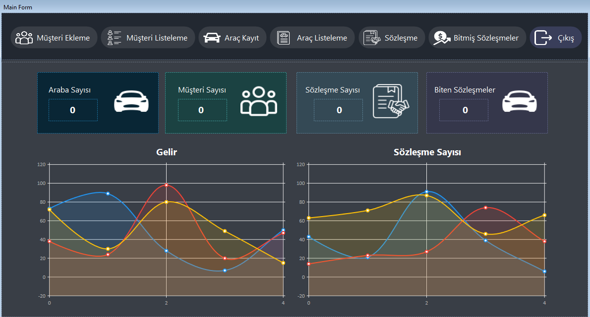
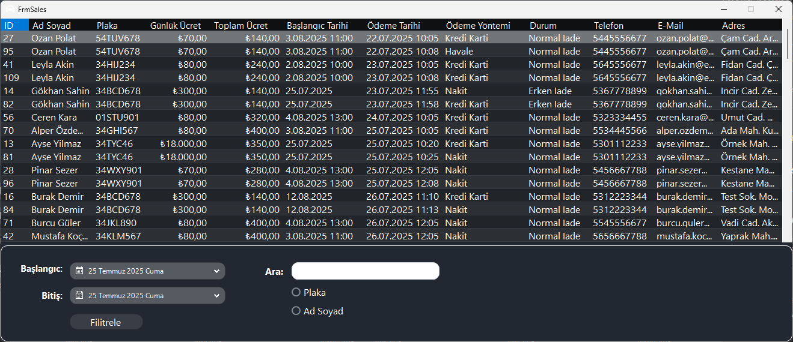

# Araç Kiralama Otomasyonu

Rent a Car Otomasyonu
Bu proje, Windows Forms tabanlı bir araç kiralama otomasyonudur. Araç ekleme ve listeleme, müşteri ekleme ve listeleme, sözleşme oluşturma ve biten sözleşmeleri görüntüleme gibi temel işlevleri içerir. Basit ama işlevsel bir yapıyla araç kiralama süreçlerini kolayca yönetmeyi amaçlamaktadır.

<!-- Programın çalışır halde bulunan video: -->

# Proje Veritabanının Kurulumu ve Yapılandırılması

Uygulamanın veritabanını kendi SQL Server Management Studio ortamınıza eklemek için aşağıdaki adımları takip ediniz:

1. SQL Server Management Studio'yu açınız.  
2. Sol kısımdaki Databases bölümüne sağ tıklayarak Import Data-tier Application seçeneğine tıklayınız. 
3. Açılan sihirbazda Next butonuna tıklayarak devam ediniz. 
4. Proje klasörüne gidip database klasörünü içerisindeki .dacpac dosyasını seçip içeri aktarma işlemini tamamlayınız. 
5. Ardından Visual Studio ortamında ClsConnection isimli sınıf dosyasını açınız. 
6. Seçtikten sonra açık olan tüm panelerde okay, okay diyerek database kurunuz.  
7. Bu sınıf içerisindeki Constring (bağlantı dizesi) alanını, kendi veritabanınızın bağlantı yoluna göre güncelleyiniz.  

 Belirtilen adımları eksiksiz uyguladığınız takdirde proje sorunsuz bir şekilde çalışacaktır.

## Dasboard Sayfası

## Müşteri Kayıt Sayfası

## Müşteri Listeleme Sayfaı

## Araba Ekleme Sayfası

## Araba Listeleme Sayfası

## Kontrat Ekleme Sayfası

## Bitmiş Kontrat Listeleme Sayfası

## Ödeme Paneli

## Hızlı Erişim Araç Listesi

